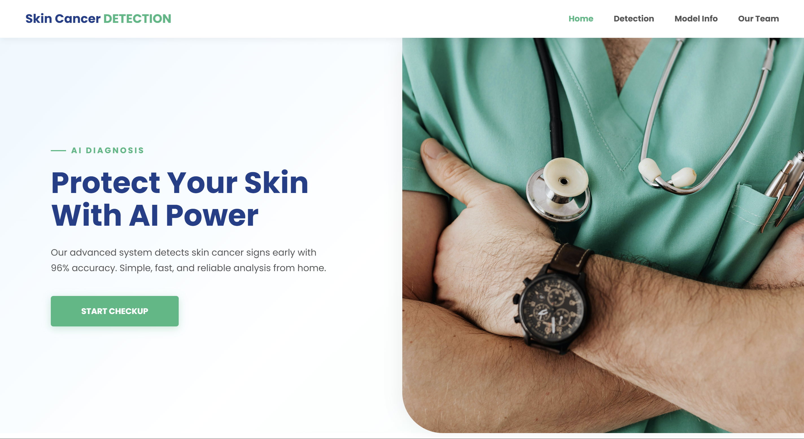
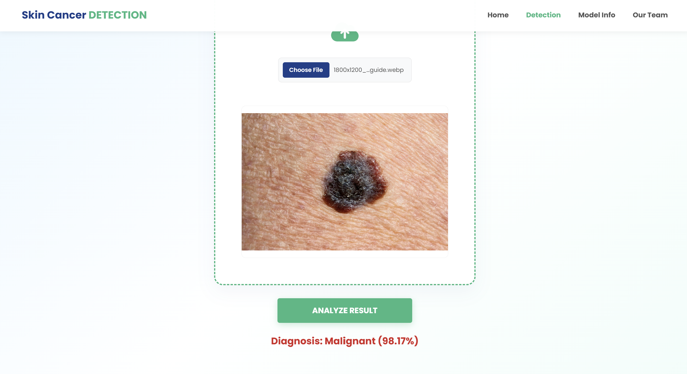
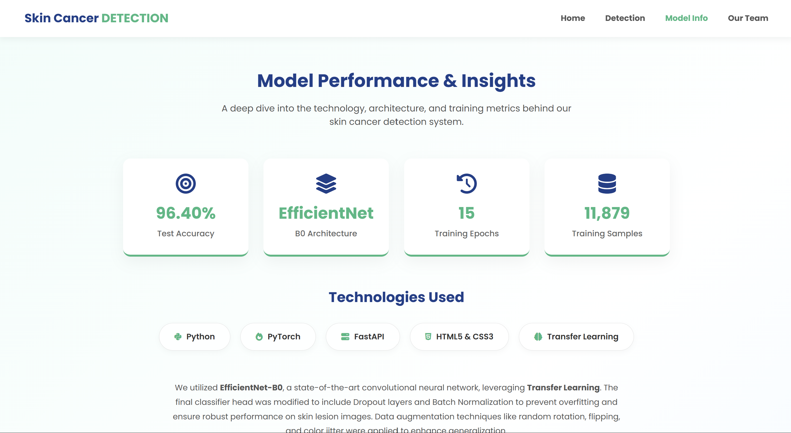
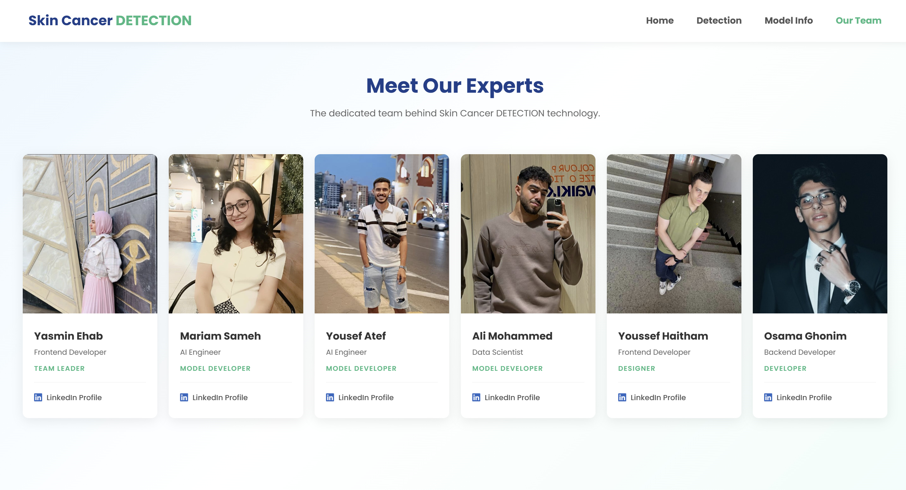

# Skin Cancer Detection System (Melanoma vs. Benign) 🎗️

This project implements an end-to-end Deep Learning solution for detecting Melanoma skin cancer. It utilizes **EfficientNet-B0** for high-accuracy image classification and provides a user-friendly Web Interface powered by **FastAPI** (Backend) and **HTML/CSS** (Frontend).

## 👥 Our Team & Task Distribution

| Name                | Role                   | Responsibilities                                                         |
| :------------------ | :--------------------- | :----------------------------------------------------------------------- |
| **Yasmin Ehab**     | Team Leader & Frontend | **UI/UX Refactoring**, CSS styling, Final UI Polish, Project Management. |
| **Mariam Sameh**    | AI Engineer            | Data Collection, Data Cleaning, Analysis, and visualization.                                |
| **Yousef Atef**     | AI Engineer            | Model Architecture Design, Transfer Learning implementation.             |
| **Ali Mohammed**    | Data Scientist         | Model Training pipeline.                              |
| **Youssef Haitham** | Frontend Developer     | **Initial Web Layout**, HTML Structure Prototyping.                      |
| **Osama Ghonim**    | Backend Developer      | API development (FastAPI), Model integration, Server logic.              |

## 🚀 Project Pipeline

Following the standard machine learning lifecycle, our project is divided into the following stages:

### 1. Problem Definition and Data Collection

- **Objective:** To build a binary classification model capable of distinguishing between **Benign** skin lesions and **Malignant (Melanoma)** skin cancer.
- **Dataset:** We utilized a labeled dataset of skin lesion images organized into `train` and `test` directories. The dataset is loaded using PyTorch's `ImageFolder` structure.

### 2. Data Cleaning and Analysis

- **Verification:** Verified image formats and directory structures.
- **Normalization:** Applied statistical normalization using ImageNet mean and standard deviation (`mean=[0.485, 0.456, 0.406]`, `std=[0.229, 0.224, 0.225]`) to ensure faster convergence during training.
- **Visualization:** Utilized Matplotlib to visualize random samples from the dataset to ensure data integrity before training.

### 3. Feature Engineering (Data Augmentation)

To improve model generalization and prevent overfitting, we applied various data augmentation techniques to the training set using `torchvision.transforms`:

- **Resizing:** All images resized to `224x224`.
- **Random Horizontal Flip:** To handle orientation invariance.
- **Random Rotation:** Rotated images by up to 10 degrees.
- **Color Jitter:** Slight adjustments to brightness and contrast to handle lighting variations.

### 4. Model Design

We employed **Transfer Learning** using the **EfficientNet-B0** architecture.

- **Base Model:** EfficientNet-B0 (Pre-trained on ImageNet).
- **Custom Head:** We replaced the default classifier with a custom Sequential layer designed for our specific binary task:
  - `Dropout (0.5)` for regularization.
  - `Linear` layer (1280 -> 512).
  - `BatchNorm1d` for stable training.
  - `GELU` activation function.
  - Final `Linear` output layer (512 -> 2 classes).

### 5. Model Training

The model was trained using the following configuration:

- **Optimizer:** `AdamW` (Weight Decay: 1e-4).
- **Loss Function:** `CrossEntropyLoss` with label smoothing (0.05).
- **Scheduler:** `OneCycleLR` for dynamic learning rate adjustment.
- **Epochs:** 15.
- **Hardware:** Trained on NVIDIA CUDA GPU.
- **Best Validation Accuracy:** Saved the model weights with the highest validation accuracy during training.

### 6. Model Testing and Inference

We evaluated the model on a separate Test set containing 2000 images.

- **Final Test Accuracy:** **96.40%**
- **Inference Logic:** The model outputs logits, which are converted to probabilities using `Softmax`. The class with the highest probability is returned as the prediction.

### 7. GUI Implementation & Application Running

**(Bonus Achieved)**: We implemented a full-stack web application.

- **Backend:** Built with **FastAPI**. It handles image uploads, preprocesses them using the same transforms as training, runs inference, and returns JSON responses.
- **Frontend:** HTML/CSS/JS interface allowing users to upload lesion images and view team details.
- **Server:** Uses `Uvicorn` to serve the application.

---

## 🛠️ Technical Stack

- **Deep Learning:** PyTorch, Torchvision
- **Backend:** FastAPI, Uvicorn
- **Frontend:** HTML, CSS
- **Data Processing:** NumPy, Pillow (PIL)
- **Visualization:** Matplotlib, Tqdm

---

## 💻 How to Run the Project

1. **Install Dependencies:**

   ```bash
   pip install torch torchvision fastapi uvicorn pillow
   ```

2. **Directory Structure:**
   Ensure the `final_best_melanoma_model.pth` file is in the same directory as `Backend.py`.
3. **Start the Server:**
   Run the backend script to start the FastAPI server.

   ```bash
   python Backend.py
   ```

4. **Access the Application:**
   Open your browser and navigate to: `http://127.0.0.1:8000/`

## 📸 Screenshots

Here is a glimpse of our application in action:

### 1. Home Page



### 2. Prediction Result (Malignant Case)



### 3. Model Info



### 4. Team Page



